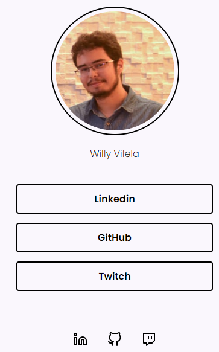

## 💻 Projeto

 Desafio consistiu em criar uma página com uma lista de links (menu) que pode ser usada em perfis de redes sociais para direcionar o usuário para o local escolhido. Utilizando HTML e CSS.

## 🚀 Tecnologias

<ul>
  <li>HTML</li>
  <li>CSS</li>
</ul>

## 🔖 Layout do Projeto

O layout pode ser visto através do Figma

[Layout Web](https://www.figma.com/file/hWF7zWWJgk8qOJTdcxCUUB/Explorer---Projeto-01-(Copy)?node-id=1%3A2)
